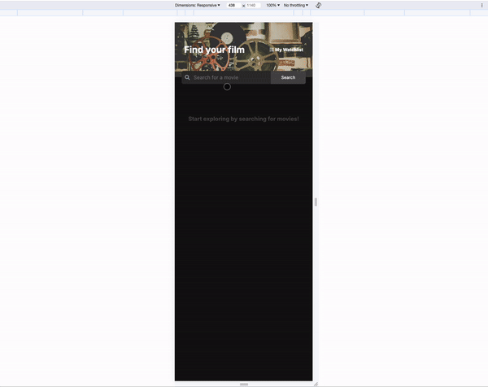

# Movie Watchlist

## Description

Movie Watchlist is a React-based web application that allows users to track and manage their favorite movies. The application gets movie information from the OMDB API and allows users to search for movies, view detailed information, add movies to a watch list, and remove movies from the list.

## Features

- Search for movies by title
- View detailed movie information (title, poster, IMDb rating, runtime, genre, plot)
- Add movies to your watchlist
- Remove movies from your watchlist
- Real-time notifications for adding and removing movies
- Responsive design for all devices

## API
- OMDB API: This application uses the OMDB API to fetch movie data. You will need an API key from OMDB to access movie information. You can get a free API key by signing up at OMDB API( <https://www.omdbapi.com/> ).

## Installation

To run the project locally, follow these steps:

1. **Get a free API key at OMDB API ( <https://www.omdbapi.com/> )**
2. **Clone the repository**

    ```
    git clone https://github.com/yourusername/my-movie-watchlist.git
    ```
    Replace `yourusername` with your GitHub username
3. **Navigate to the project directory**

    ```
    cd my-movie-watchlist
    ```
4. **Install dependencies**

    ```
    npm install
    ```
5. **Enter your API key in `Home.jsx`**

    Open `Home.jsx` and replace `"5d1ecff"` with your own API key from OMDB API.
    ```
    const apiKey = "YOUR_API_KEY"
    ```
6. **Set Local Storage**

    Ensure you have a local storage key named `"myWatchlist"` or it will be created automatically.
7. **Run the Project Locally**
    ```
    npm run dev
    ```
    This will start the development server.

## Technologies

- **React :** JavaScript library for building user interfaces
- **JavaScript :** ES6 and later
- **HTML :** HTML5
- **CSS :** Modern styling techniques including Flexbox and Grid Layout
- **OMDB API :** Used to fetch mobie data and provide detailed information about movies

## Dependencies

- React
- React-DOM
- React-Router-DOM
- Vite

## Demo

<div  align="center">
    
</div>

## Usage

1. Open your browser and navigate to the local server started by `npm run dev`.
2. Use the search bar to find movies by title.
3. Click `+ Watchlist` button to add a movie to your watchlist.
4. Manage your watchlist from the watchlist page, where you can remove movies by clicking the `- Remove` button.
